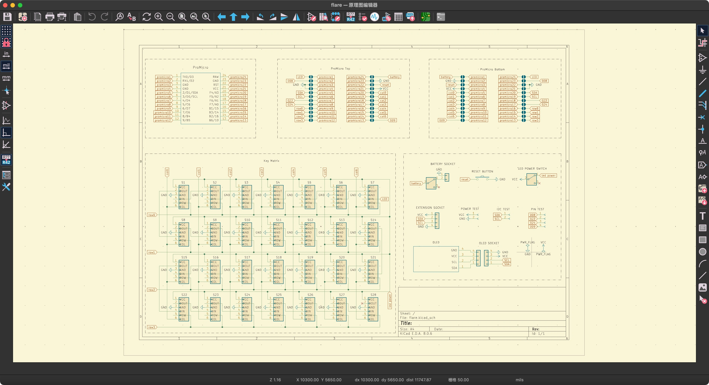
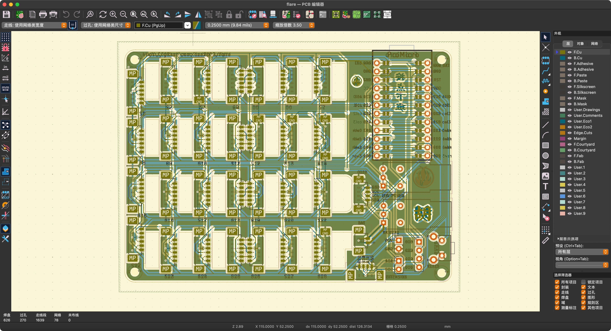

<div align="center">
  
  <h1 style="text-align: center;">KiCad Gruvbox Light Theme</h1>
</div>

EESCHEMA         |  PCBNEW
:-------------------------:|:-------------------------:
  |  

Gruvbox Light for KiCAD - **THE FUTURE IS HERE**

Based on the dark Gruvbox theme from [AlexanderBrevig](https://github.com/AlexanderBrevig/kicad-gruvbox-theme).

Based on the original color scheme [Gruvbox](https://github.com/morhetz/gruvbox).

This is my KiCAD daily-driver theme.


## Install theme

> Replace the version `6.0` to the actually version you are using!

- Linux `~/.config/kicad/colors` or `~/.config/kicad/6.0/colors`
- Windows: `%APPDATA%\kicad\6.0\colors`
- OSX: `~/Library/Preferences/kicad/colors` or `~/Library/Preferences/kicad/6.0/colors`

You can simply `cd` your way there and get `Gruvbox.json` in there somehow.

```shell
cd ~/.config/kicad/6.0/colors
curl 'https://raw.githubusercontent.com/hza2002/kicad-gruvbox-light-theme/refs/heads/main/colors/Gruvbox%20Light.json' > 'Gruvbox Light.json'
```


## Contribute


I have not really landed on any convention as for when to use which color.
Feel free to make suggestions or PR, I will probably merge them if you explain the thought behind your change.


## Thanks


- https://www.kicad.org/ for the amazing tool
- https://github.com/morhetz/gruvbox for the theme
- https://github.com/AlexanderBrevig/kicad-gruvbox-theme for the KiCad theme
- https://github.com/jdinhify/vscode-theme-gruvbox for the icon
